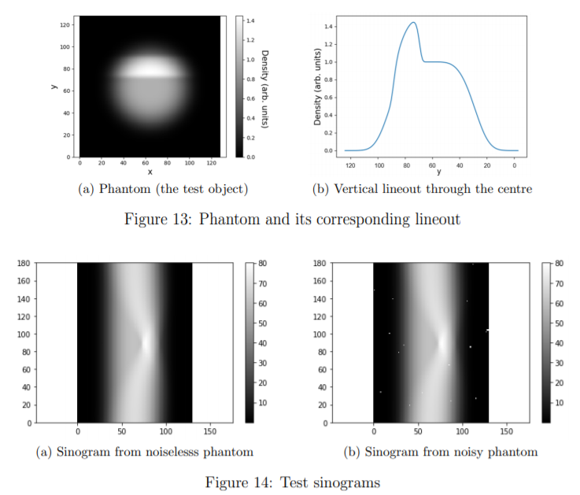
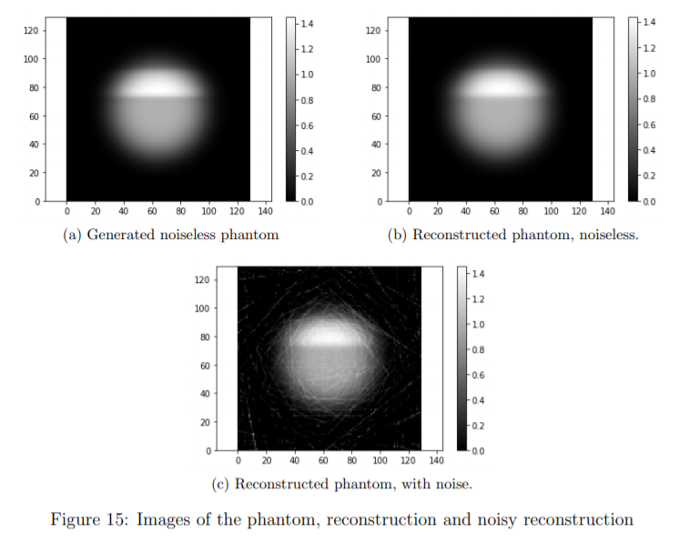
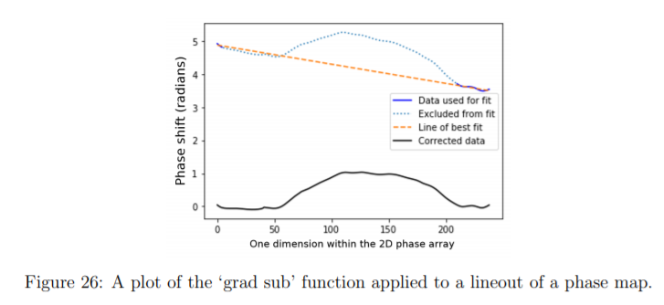
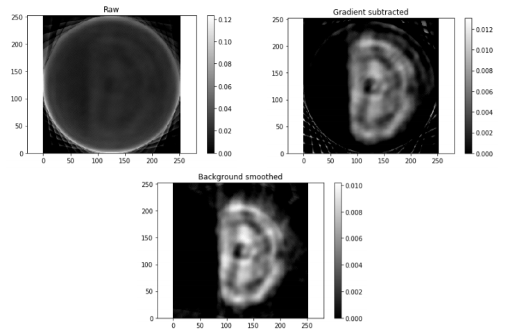

# Image-Reconstruction-MSci-Project-
The Python code written and developed by me and my master's project partner, Elliot Prestidge. 

The 'central' Python script for performing the image reconstruction is called batch_tomography.py, which does its job by calling different functions from within the other scripts.

The code takes the interferograms from the laboratory experiment, applies two tomographic reconstruction algorithms: filtered back projection (FBP) and the simultaneous iterative reconstruction technique (SIRT).

The tomographic reconstruction is consequently obtained. The varied roles of the different scripts include: image quality data improvement, performing reconstruction error analysis, and generating simulation data for algorithm testing. 

